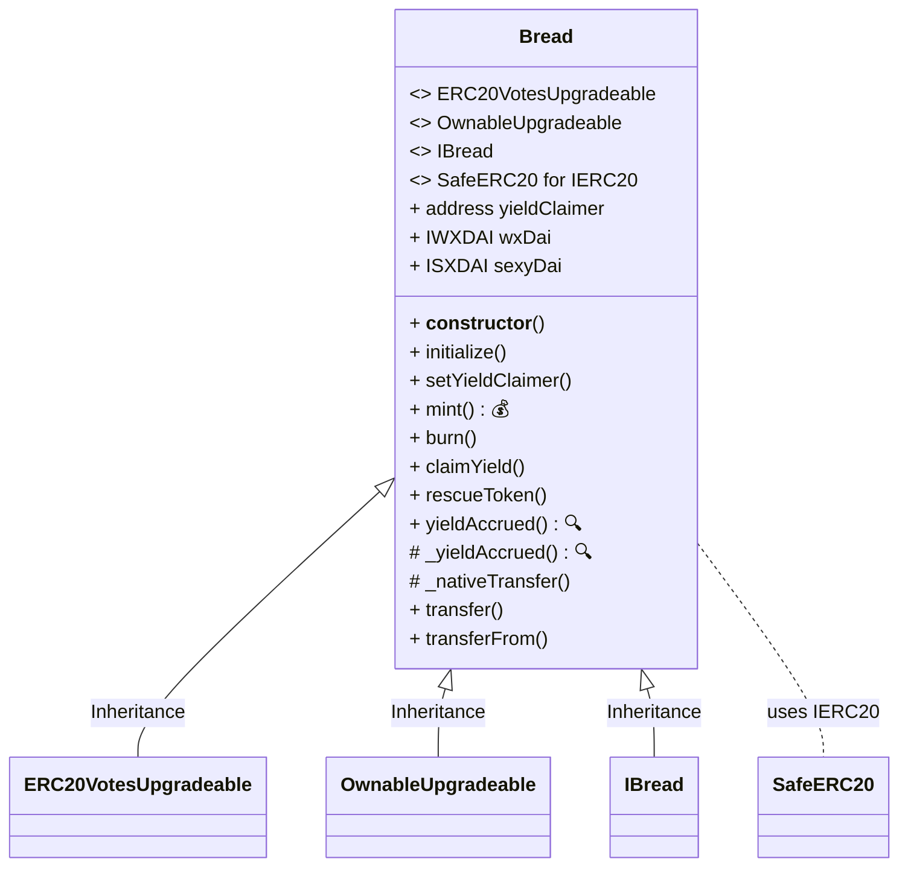

## What is BREAD?

BREAD is the community currency for the Breadchain ecosystem which exists on Gnosis Chain. All BREAD is created through the [Bread Crowdstaking Application](https://www.notion.so/Crowdstaking-Application-9f233bc2fb1e419ebeb58a2809b21658?pvs=21) which anyone with xDAI on Gnosis Chain is able to use to have some BREAD for themselves.



The Crowdstaking Application is a smart contract on Gnosis Chain that accepts a user’s xDAI and turns it into sDAI. In exchange, stakers receive BREAD tokens, minted at a 1-to-1 ratio with the collateralized xDAI.

All of the interest earned on the sDAI is helps fund the collective and its various member projects based on a monthly vote from BREAD holders. The Crowdstaking Application functions as a fundraising engine for the Breadchain Cooperative, while the BREAD token acts as a local currency within the ecosystem, promoting financial sustainability.

Additionally, BREAD holders are able to to vote on how the yield generated from the sDAI is distributed among the projects part of the Breadchain Network every month. 

[Gnosis Chain Deployment](https://gnosisscan.io/token/0xa555d5344f6fb6c65da19e403cb4c1ec4a1a5ee3)

## Technical Breakdown 
### Minting
```solidity
1   function mint(address receiver) external payable {
2       // ... validation snippets  
3       wxDai.deposit{value: val}();
4       IERC20(address(wxDai)).safeIncreaseAllowance(address(sexyDai), val);
5       sexyDai.deposit(val, address(this));
6
7       _mint(receiver, val);
8       
9       // ... delegation snippet 
10  }
```
On line 3 the native currency (xDai) of Gnosis Chain gets converted to an ERC20 representation ([wxDai](https://gnosisscan.io/address/0xe91D153E0b41518A2Ce8Dd3D7944Fa863463a97d)). This is done because in order to lock the xDai.

[sDai](https://gnosisscan.io/address/0xaf204776c7245bF4147c2612BF6e5972Ee483701) is an automatic mechanism that allows a user to recieve yield from the [Dai Savings Rate](https://blog.makerdao.com/why-the-dai-savings-rate-is-a-game-changer-for-the-defi-ecosystem-and-beyond/) by depositing and locking wxDai. This is how BREAD generates yield.
On line 4 , the Bread contract allows the [sDai contract](https://gnosisscan.io/address/0xaf204776c7245bF4147c2612BF6e5972Ee483701) to take xDai from itself.

On line 5 , the wxDai is deposited and turned into sDai, which is in possession by the BREAD contract.

On line 7 , BREAD is minted to the reciever as a voucher for their deposit. This enables the reciever to redeem their BREAD for the amount of xDai that was deposited.

Lets look at another snippet from the BREAD contract , which is used to calculate how much yield is available for the Breadchain federation. 

```solidity
1   function _yieldAccrued() internal view returns (uint256) {
2       uint256 bal = IERC20(address(sexyDai)).balanceOf(address(this));
3       uint256 assets = sexyDai.convertToAssets(bal);
4       uint256 supply = totalSupply();
5       return assets > supply ? assets - supply : 0;
6   }
```

