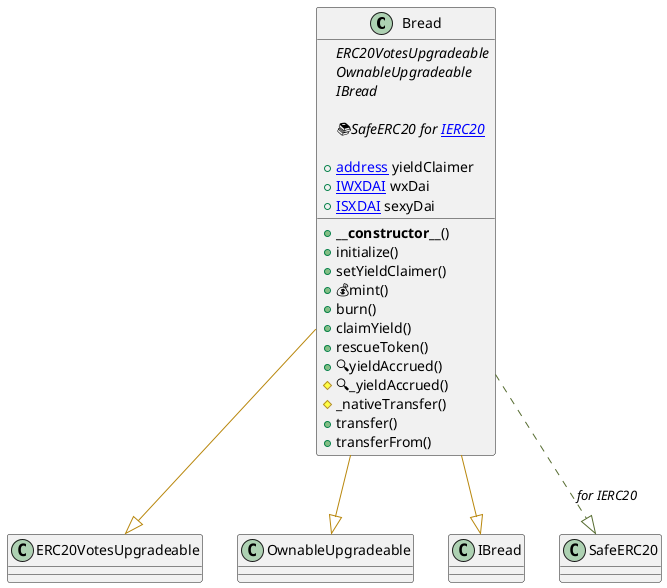

```plantuml
@startuml
' -- generated by: https://marketplace.visualstudio.com/items?itemName=tintinweb.solidity-visual-auditor
'
' -- for auto-render install: https://marketplace.visualstudio.com/items?itemName=jebbs.plantuml
' -- options --


' -- classes --


class Bread {
    ' -- inheritance --
	{abstract}ERC20VotesUpgradeable
	{abstract}OwnableUpgradeable
	{abstract}IBread

    ' -- usingFor --
	{abstract}📚SafeERC20 for [[IERC20]]

    ' -- vars --
	+[[address]] yieldClaimer
	+[[IWXDAI]] wxDai
	+[[ISXDAI]] sexyDai

    ' -- methods --
	+**__constructor__**()
	+initialize()
	+setYieldClaimer()
	+💰mint()
	+burn()
	+claimYield()
	+rescueToken()
	+🔍yieldAccrued()
	#🔍_yieldAccrued()
	#_nativeTransfer()
	+transfer()
	+transferFrom()

}
' -- inheritance / usingFor --
Bread --[#DarkGoldenRod]|> ERC20VotesUpgradeable
Bread --[#DarkGoldenRod]|> OwnableUpgradeable
Bread --[#DarkGoldenRod]|> IBread
Bread ..[#DarkOliveGreen]|> SafeERC20 : //for IERC20//

@enduml
```