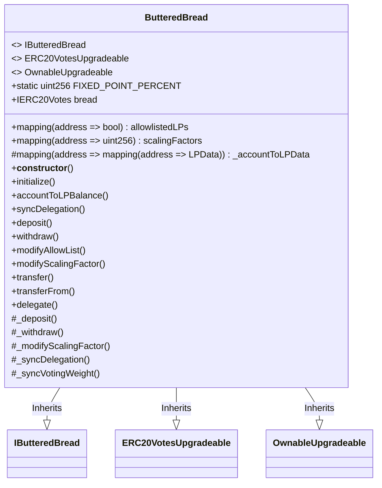
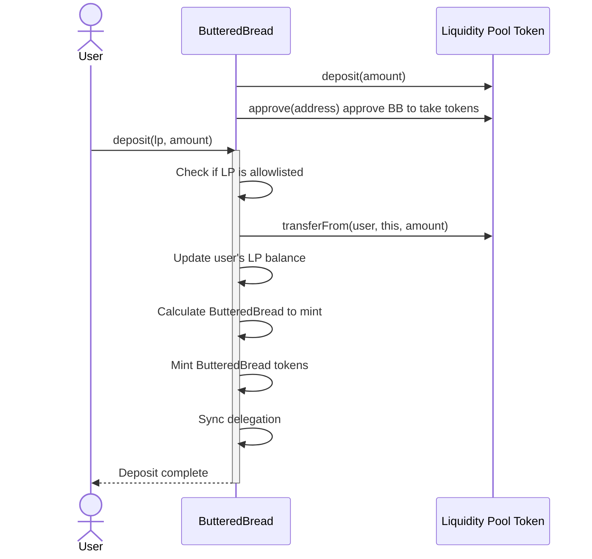
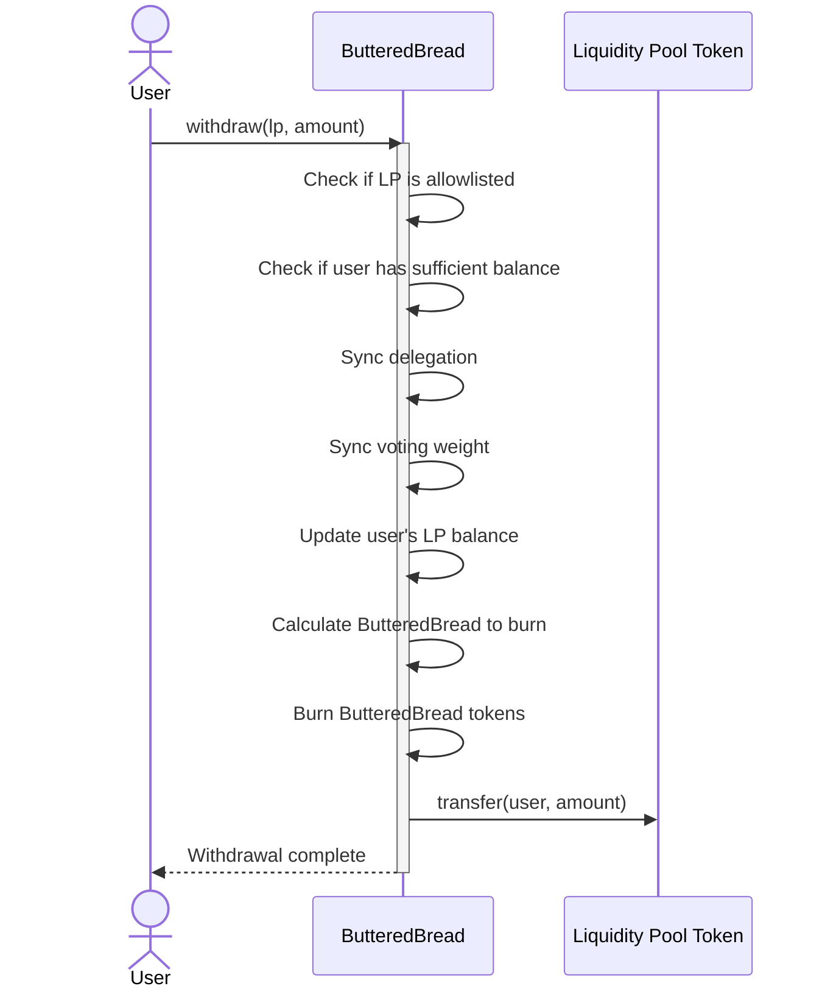

# Buttered Bread 

The ButteredBread contract is designed to enhance liquidity provision and governance participation within the Breadchain ecosystem. At its core, it allows users to deposit Liquidity Pool (LP) tokens, referred to as "Butter," and in return, mint ButteredBread tokens. These ButteredBread tokens represent a scaled version of the deposited LP tokens, with the scaling factor determined for each supported liquidity pool. This mechanism incentivizes users to provide liquidity to specific pools by offering voting power.

A key feature of the ButteredBread contract is its integration with the BREAD token's governance system. While ButteredBread tokens themselves are non-transferable, they inherit the voting power and delegation mechanics of the underlying BREAD token. This is achieved through a unique synchronization process where the ButteredBread contract mirrors the delegation choices made by users in the BREAD token contract. Additionally, the contract allows for dynamic adjustment of scaling factors, enabling the protocol to fine-tune incentives for different liquidity pools over time. 

## Deposits 

1. User calls deposit function with LP address and amount.
2. The contract checks if the LP is allowlisted.
3. It transfers LP tokens from the user to the contract.
4. Updates the user's LP balance in the contract's storage.
5. Calculates the amount of ButteredBread tokens to mint based on the scaling factor.
6. Mints the calculated amount of ButteredBread tokens to the user.
7. Syncs the user's delegation based on their delegation in the $BREAD contract 

## Withdrawals

1. User calls `withdraw` function with LP address and amount.
2. The contract checks if the LP is allowlisted.
3. It checks if the user has sufficient balance to withdraw.
6. Updates the user's LP balance in the contract's storage.
8. Burns the calculated amount of ButteredBread tokens from the user.
9. Transfers the LP tokens back to the user.