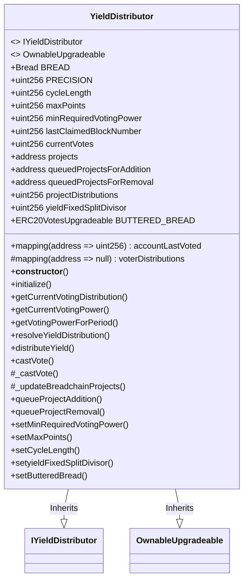
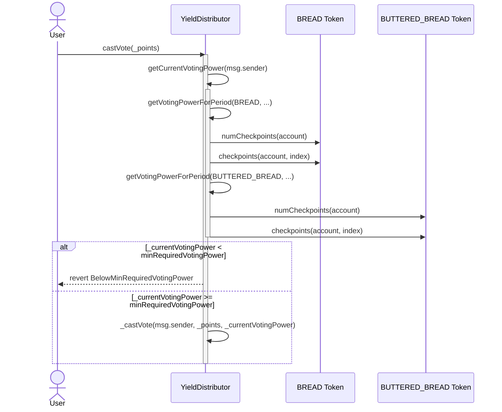
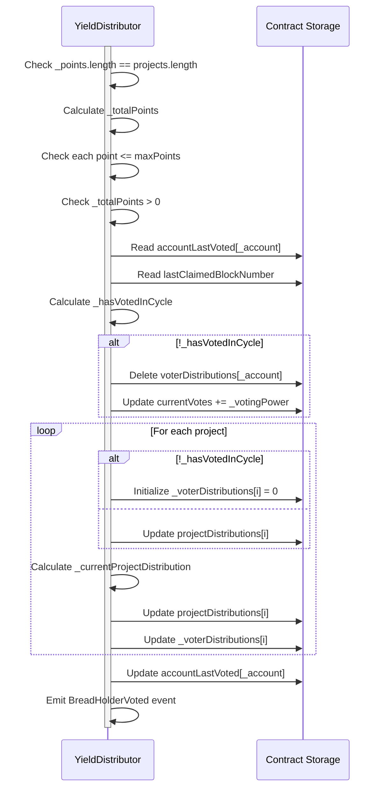
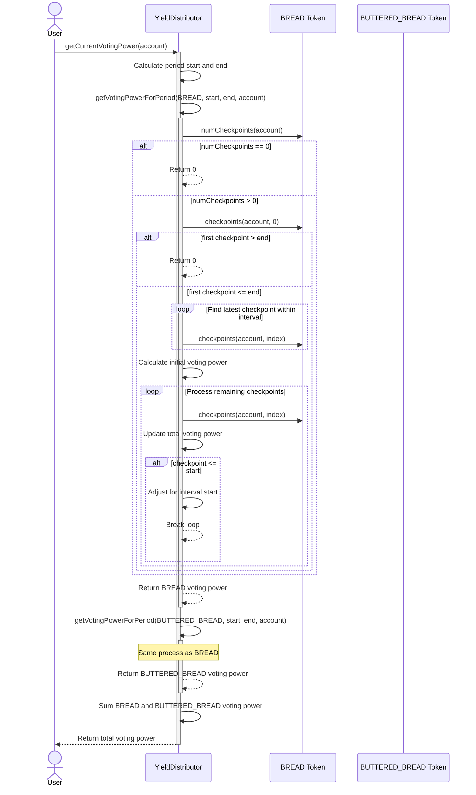

# YieldDistributor 
The YieldDistributor contract is a smart contract designed to manage and distribute yield (in the form of $BREAD tokens) to eligible member projects within the Breadchain ecosystem. This contract implements a voting mechanism that allows token holders to influence the distribution of yield across various projects. By leveraging both $BREAD and $BUTTERED_BREAD tokens, the system creates a dual-token voting power structure, encouraging active participation and long-term commitment from community members.

At its core, the YieldDistributor contract enables a democratic and transparent process for allocating resources within the Breadchain network. It features a cyclical distribution system, where token holders can cast votes using their voting power, which is calculated based on their token holdings over time. The contract supports dynamic project management, allowing for the addition and removal of eligible projects, and incorporates both fixed and voted components in the yield distribution to ensure a balance between equity and direct democracy. 

# Voting 
The `castVote` function allows users to participate in the yield distribution process by allocating their voting power to different projects. Here's a detailed explanation:

1. The function takes an array of `_points` as input, representing the user's vote allocation for each project. These points allow for a dynamic and flexible voting system:

   - Each project can be assigned a number of points, up to `maxPoints`.
   - The total number of points allocated across all projects can vary.
   - The actual voting power distributed to each project is calculated proportionally based on the points allocated.
   - This system allows users to express their preferences with fine-grained control, as they can allocate any number of points (up to `maxPoints`) to each project.
   - For example, if there are two projects and `maxPoints` is 100, a user could vote [100, 50], [1, 2], or any other combination, providing a wide range of possible distributions within the precision of the points system.

2. It first calculates the user's current voting power using `getCurrentVotingPower`.

3. It checks if the user has sufficient voting power to participate. If not, it reverts.

4. If the user has enough voting power, it calls the internal `_castVote` function.

The internal `_castVote` function does the heavy lifting:

Here's what this function does:

1. It checks if the number of points matches the number of projects.

2. It calculates the total points and ensures they don't exceed the maximum allowed per project.

3. It checks if the user has already voted in this cycle.

4. If it's a new vote in the cycle, it resets the user's previous votes and adds their voting power to the current total votes.

5. For each project:

   - If it's a new vote, it initializes the user's distribution for that project.

   - If it's an update to an existing vote, it subtracts the user's previous distribution.

   - It calculates the new distribution based on the points allocated and the user's voting power.

   - It updates both the overall project distribution and the user's personal distribution.

6. It updates the last voted block number for the user.

7. Finally, it emits an event with the voting details.

Key points:
- The function allows users to update their votes within a cycle.
- It uses precision calculations to ensure accurate distribution of voting power.
- It maintains both global project distributions and individual user distributions.
- The voting power is based on the user's token holdings (both BREAD and BUTTERED_BREAD) over a specific period.

## Voting power 

Now, let's break down the getVotingPowerForPeriod function step by step:
1. Input Validation:
    - Check if the start time is before the end time.
    - Ensure the end time is not after the current block.
2. Initial Checkpoint Check:
    - Get the total number of checkpoints for the account.
    - If there are no checkpoints, return 0 voting power.
3. Boundary Checks:
    - If the first checkpoint is after the end of the interval, return 0 voting power.
4. Find Relevant Checkpoints:
    - Start from the latest checkpoint and move backwards.
    - Find the most recent checkpoint that is within or before the end of the interval.
5. Initialize Voting Power Calculation:
    - Set the initial voting power based on the latest relevant checkpoint.
    - Calculate the duration from this checkpoint to the end of the interval.
6. Process Earlier Checkpoints:
    - Iterate through earlier checkpoints, moving backwards in time.
    - For each checkpoint:
        - Calculate the voting power for the sub-interval between checkpoints.
        - Add this to the total voting power.
        - If the checkpoint is before or at the start of the interval:
            - Adjust the voting power to exclude time before the interval start.
            - Break the loop as we've covered the entire interval.
7. Return Total Voting Power:
    - The function returns the accumulated voting power over the specified interval.
Key Points:
    - The function uses a checkpoint system to track voting power changes over time.
    - It calculates voting power as a product of token balance and time held within the specified interval.
    - The calculation is done separately for both BREAD and BUTTERED_BREAD tokens, then summed for the total voting power.
    - This method allows for accurate representation of voting power even with balance changes during the period.
    - This approach ensures that voting power is proportional to both the amount of tokens held and the duration of holding within the specified period, promoting long-term engagement and preventing last-minute large token transfers from disproportionately influencing votes.